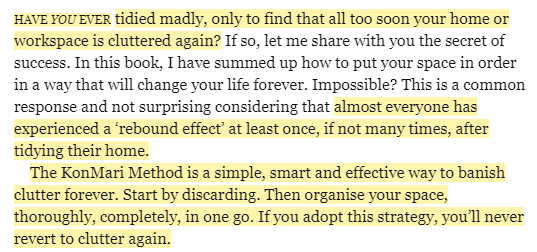
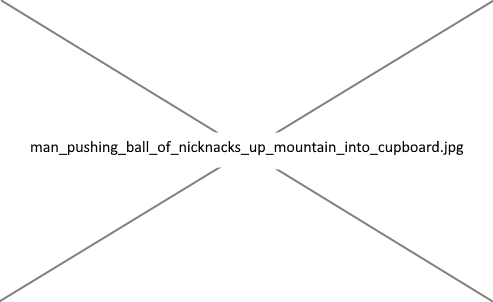
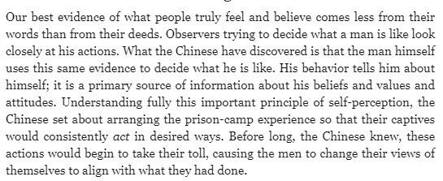
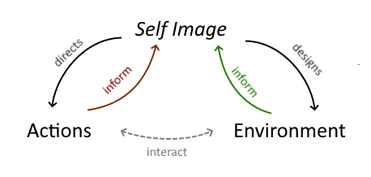

# The Magic of Marie Kondo — Homeostatis

1. [The Magic of Marie Kondo — Homeostatis](#the-magic-of-marie-kondo--homeostatis)
   1. [Fixing clutter the easy way](#fixing-clutter-the-easy-way)
   2. [Environment and Character](#environment-and-character)
   3. [Spark Joy](#spark-joy)
   4. [Q/A](#qa)

In this series I will be reading 'The life changing magic of tidying' by Marie Kondo. I am using the Cathy Hirano translation (2014 edition).

To ensure purity of interpretation, I have done no research on Kondo the person. I am also avoiding all her other works and any secondary sources. I refrained from re-reading past the introduction of the book so as to preserve my first (pure) impression of her work.

All analysis will be based purely on the aggressive projection of my own ideas onto the text.

## Fixing clutter the easy way

_"The gods had condemned Sisyphus to ceaselessly rolling a rock to the top of a mountain, whence the stone would fall back of its own weight. They had thought with some reason that there is no more dreadful punishment than futile and hopeless labor."_

Each evening, I do my best to remove all traces of the day from my home. I return objects to where they were that morning. I clean anything that was dirtied from use. I discard rubbish that has appeared on tables. I sweep out the crumbs that inexplicably cover every flat surface exposed to a toddler.

Like Sisyphus, there is no sense of achievement, only a feeling of relief that the task is complete for the day. Relief that we can rest, at least, for the duration of the walk back down the mountain. There, our stone awaits.

The tragedy of human life is this daily exertion to return to some desired state, a state that crumbles the next day, needing to be achieved anew. Nothing endures, nothing remains, you will not remember the time spent on these tasks, you do not enjoy them, it does not change or improve you. **Each day dies behind you.**

Kondo's promise to the reader in this paragraph is an escape from the underworld. Not only will their home be tidy, but it will never become cluttered again. The path to immortality is in building, and Kondo tells us that something permanent is being built here. Her method, she stresses, with change your life forever.

Forever!

Kondo is not a minimalist. She advocates for reducing the number of items you own but she wants people to hang on to anything that "sparks joy".
She doesn't mind if they have an obsession that covers their walls, she can work with that. Her solution is not simply to get rid of all your possessions.

There do exist people who have no issues with clutter. There are also those who tidy a bit here or there, but never quite manage to improve things permanently. They are just barely holding back the sea of clutter.

The book is targeted at this second sort of person, and the solution offered is to become the first sort. The issue is not in their possessions, their storage system or how they fold their clothes, the issue is their **character**.

The solution is simple. They will become someone who no longer generates clutter. Tidying will no longer be part of their life, everything will simply, effortlessly, remain in order. To achieve this there are three steps:
- First, their environment and self-image are reset suddenly. 
- Second, their character is carefully carved away until it becomes harmonious with this new environment.
- Finally, the new character is made permanent through ritual and habit.

## Environment and Character

Imagine yourself going on holiday. Just you, alone. You arrive in a new town, you have one small suitcase. After checking-in to the guest-house, you put down your suitcase and look around the room. It is clean and tidy. Fresh white linen on the double bed. The window is open and a cool evening breeze is blowing in. A vase of flowers is on the bedside table. You leave your bag in the room and head out of the hotel, you stroll through the town and feel completely free, totally at peace. Leaving your usual surroundings has changed your mood, your habits, your self-image.

I said earlier that the solution to clutter will be changing a person's character, so why the focus on their environment?

When our bodies get too cold, various processes kick in to bring our temperature back up: blood flow to extremities is reduced, the hair on our arms stands up, we begin to shiver. When too hot, we sweat. Whenever the temperature leaves the body's preferred set-point, it is brought back down by these methods. This sort of feedback mechanism is called homeostasis and is common in the body. **In the same way, I believe our environment plays a homeostatic role in controlling our character.**

By environment, I mean all physical residue of our will on the world: our body, our clothing, where we live, our possessions, etc: To determine what sort of person we are we look at our past actions and extrapolate. 

The classic example is Cialdini's anecdote of the Chinese prisoner of war camp during the Korean war (from Influence)

In the same way, we also look at our clothing, our house, our hairstyle, our family, our friends, and extrapolate from that.

This environment is an expression of our self-image. However, our self-image is also influenced by our environment. The two act on each other and the system oscillates until it comes to rest at the set-point which is, essentially, our 'character'. In this way, our character resists change. We tend to be consistent.

**But, the set-point CAN be changed.** Just as resting core temperature drops if you stay somewhere hot for a week or two, we can move our self-image set-point by sharply changing either one of environment or actions.

The reason we move environment first, rather than trying to change actions and let that shift environment, is that environment is more stable. Environment can be changed in one big push and will passively resist change for a while. It is much slower to revert than actions. Conversely, a change in actions (for example a change in habits) needs to be constantly maintained or it will revert quickly. Energy needs to be expended to continue the change until it eventually becomes permanent.

In our body-heat metaphor, it is the difference between doing jumping jacks every 5 minutes to keep warm, versus putting on a coat.

As soon as the system is out of homeostatis, we feel discomfort. There is a pressure to reach a new set point where the system is at rest — where our actions and environment are coherent.

To strengthen the effect further, Kondo does everything possible to make you focus on the change that is occurring in the environment. You are to do this process in one fell swoop for each category of item — you spread out every piece of clothing you own on the floor, you touch each one. You are made *very mindful* of what is happening. The process is framed as a positive one with the concept of 'spark joy', the focus is on 'improving my environment' not just on discarding.

She also mentions talking to her bags, caressing them, being kind to her socks, etc. Again, this sort of ritual behavior where she thanks her objects focuses you on the environment around you, allowing it to be a constant reminder of your new self, strengthening the effect we are trying to achieve.

## Spark Joy

As soon as we have yanked the environment to a new point, and there is building pressure for our actions and self-image to move in that direction, our character is ready to change. This is mostly implicit in `The life-changing magic of tidying`, the focus is on the environment, but Kondo very much expects the environmental change to cause a personality change: she suggests her method will "change your life forever", which is a bit melodramatic when talking about tidying, but makes sense when you understand this is a full-life holistic system for changing your character.

The idea that you should curate your home and clothing, that you should have a personal style: this is widespread. Fewer people also focus on curating their character. (nb. in the corner of twitter I swim in, this might be more common, since most people are alts/anons and consciously chose all or part of the personality they are inhabiting)

(It is possible that some people need to increase the amount of clutter in their house to achieve a particular style, in this case, you would do the opposite of what Kondo suggests, you maniac. You would make your environment suddenly messier, and work to adjust your character to become similarly more unorganised and chaotic.)

You might think that the more items you discard, the less defined the style of your character becomes, but the opposite is true.
Minimalists are defined _more_ by their possessions than most,  not less. They are closest to maximalists (ex. collectors) in how they define themselves by what they own. For a minimalist, each item is a strong identity claim, when you own one shirt, the choice of shirt represents you.

An overflowing wardrobe tells you little about the owner, in the same way that an uncarved block of stone has no style. It is only when you begin to cut away at the unnecessary parts that the style emerges. 

_The things that do NOT spark joy are things that do not fit, things that need to be removed._ The second part of the process is simply to repeat the Kondo procedure on your character, as you did on your possessions:

There are styles of character that are more fitting to each person, that can be revealed through careful paring away at the flabby parts of the self. Application of a singular taste to the raw materials of the self, not trying to make it something it is not, but achieving the potential contained within.

The environment you designed is one implementation of this style, an example to be copied. All that is needed is to match your actions to your environment.

At the unattainable end of our training regime, the goal is a life where we desire to do what we believe we ought to do. Where all our fibres are pointing in the same direction. Our speech, thoughts, actions and environment all have the same style.

Kondo knows that in this holy space, clutter is no longer a problem.

## Q/A

Q: _Hah, it's ironic how lacking in style your writing is!_

A: Yep.

Q: _Is what you wrote even true?_

A: What do you mean, did Kondo actually mean this in her book? Maybe.

Q: _No, I mean, does it actually work? Is this how self-image and character work?_

A: I don't know.

Q: _Does your house look like a zen dormitory?_

A: Haha. No.

Q: _Then why are you writing this? You haven't actually checked if this works??_

A: No!

Q: _That is irresponsible! What is someone tries to improve their character in this way and it turns out to be inefficient_

A: To be honest, if this does work, it probably works better if you don't know what is happening, so I would not suggest self-improvers read this article. This is more a fun exploration of a hypothesis for people who enjoy thinking about self-improvement from the outside, while keeping a safe distance.
