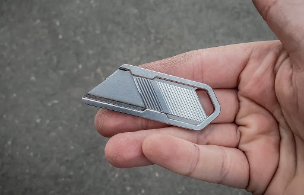
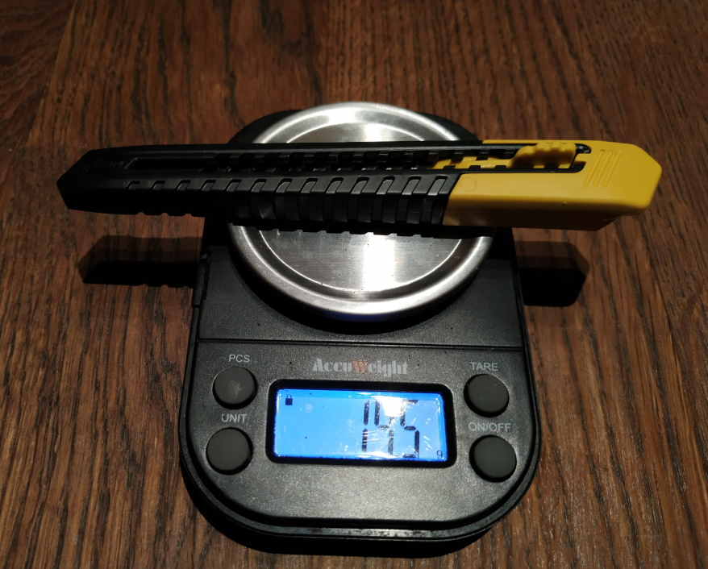
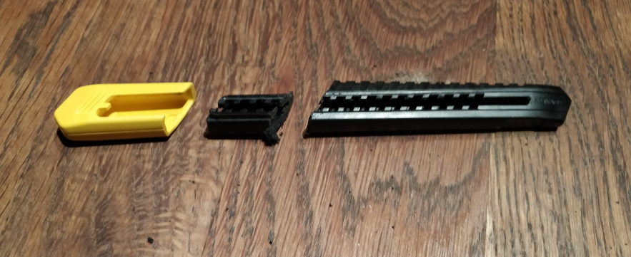
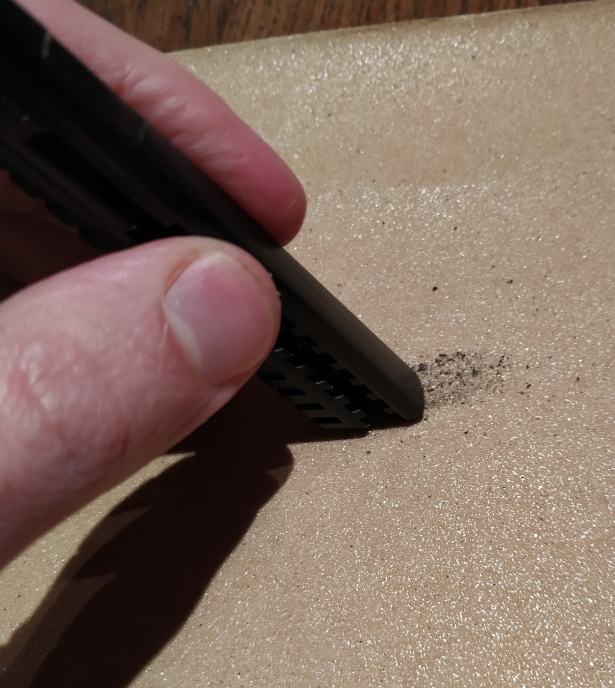
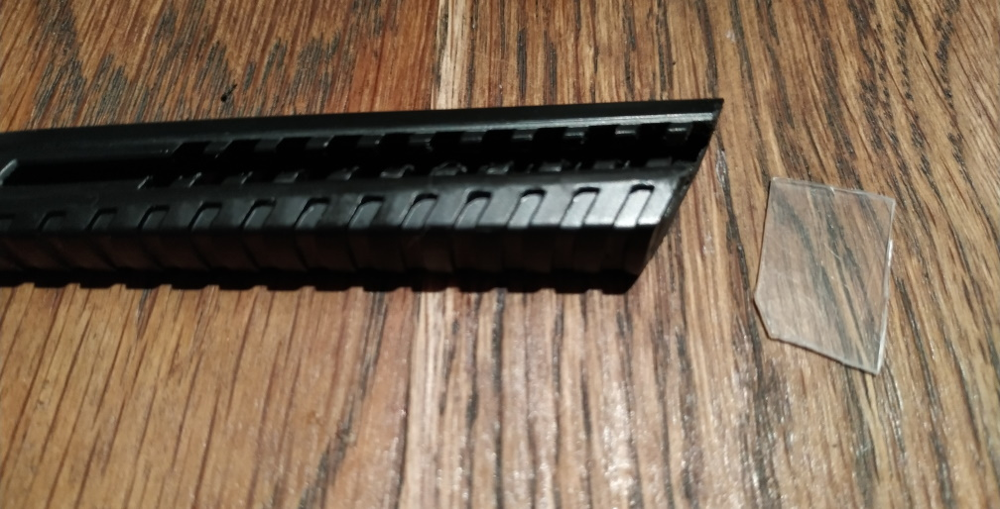
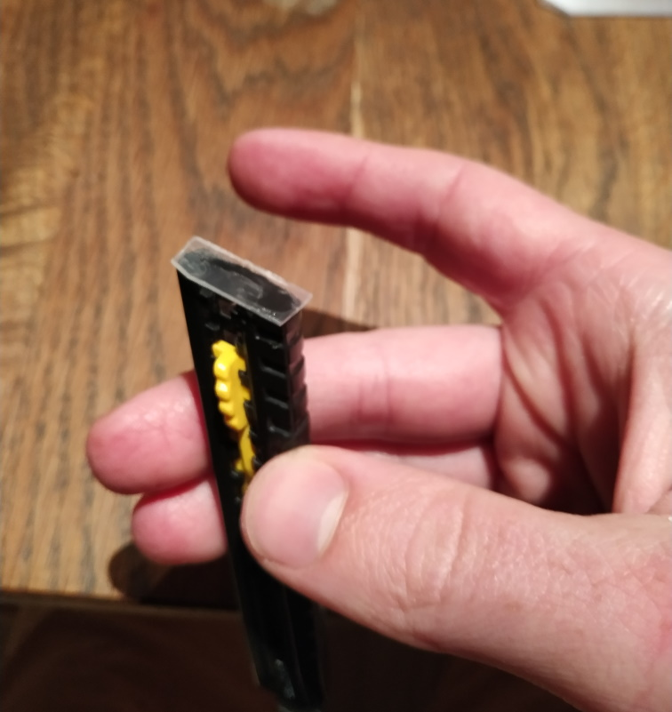
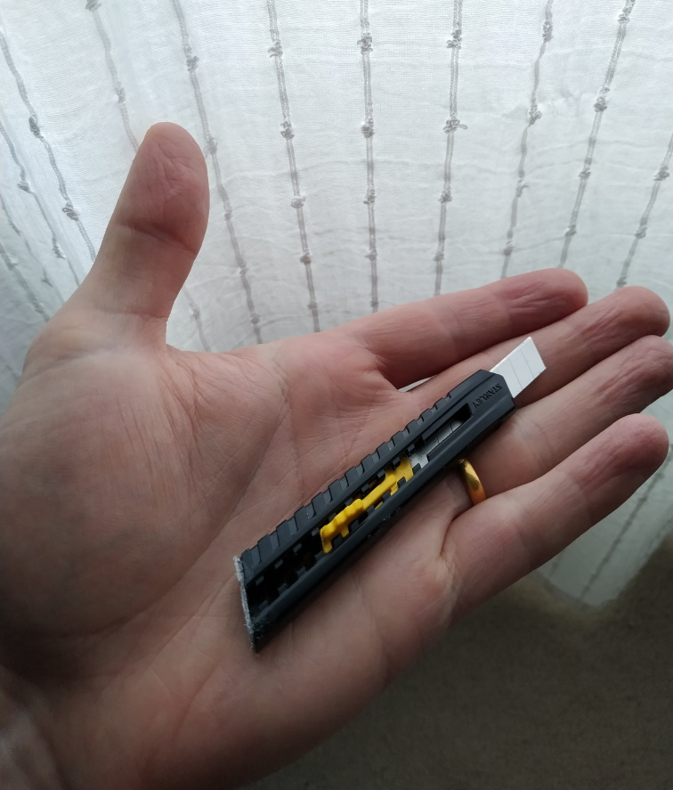

# Ultralight Knife

I have been looking around for a good knife to carry, both around the house and when I'm on a walk. I had the following requirements:

- Cheap
- Light (I don't like having heavy things in my pockets)
- Ultralight (when walking, we must be ultralight)
- Sharp
- Easy to keep sharp (I am bad at sharpening, and do not have time to spend on it)
- Small (possible to slip into a pocket and not notice it)

I was willing to sacrifice durability to achieve this. You will not be able to baton or do woodcraft with this thing!

I liked the look of the reversible utility blade holders I found, but could not see any decent ones in the UK at a sensible price. They are also a little _too_ short in my opinion, hard to get a decent grip on them when sharpening a stick or cutting through rope.

In the tradition of "ultra cheap is ultralight" I checked the weights on the cheapo snap-off utility blade knives, and found them to be <20g for the most part, although a little long, so I decided to see if I could modify it to fit my needs.

Our donor knife is the Stanley SM9 snap-off blade knife. You can get a 3-pack for £3.81 on amazon right now. This starts off at 14.5g, 11.5cm in length. It is already difficult to compete with the weight of this knife, and it gets lighter the more you use it!

First I removed the end cap and cut off the last 4 blade notches to shorten the handle.

Next, I sanded the butt off the handle flat to help accept glue. You could use the blade as it is, but it would be possible for the blade to slip out the back when you retract it. This is probably not dangerous, but annoying, especially if it happens in the dark when you have cold hands.

To stop this, I attached a thin piece of plastic to the back of the knife using clear gorilla glue. I sanded the plastic flush to the handle.

This does mean the blade can no longer be easily replaced, to replace it you would pry the plastic off then stick it back again. Since you can snap the blade off quite a few times before exhausting it, I don't mind this limitation.

To be honest, with a knife costing about £1 you could just throw it away and make a new one!

- Once the glue is dry, we have a final weight of 9.5g! (0.33oz). The knife is about 8cm long which fits perfectly in my pocket while allowing a solid grip.
    - Ultralight and compact
    - One handed deployment and retraction
    - Very sharp blade
    - Adjustable blade (short for carving a stick, long for cutting cheese)
    - Snap off the blade when it gets dull

